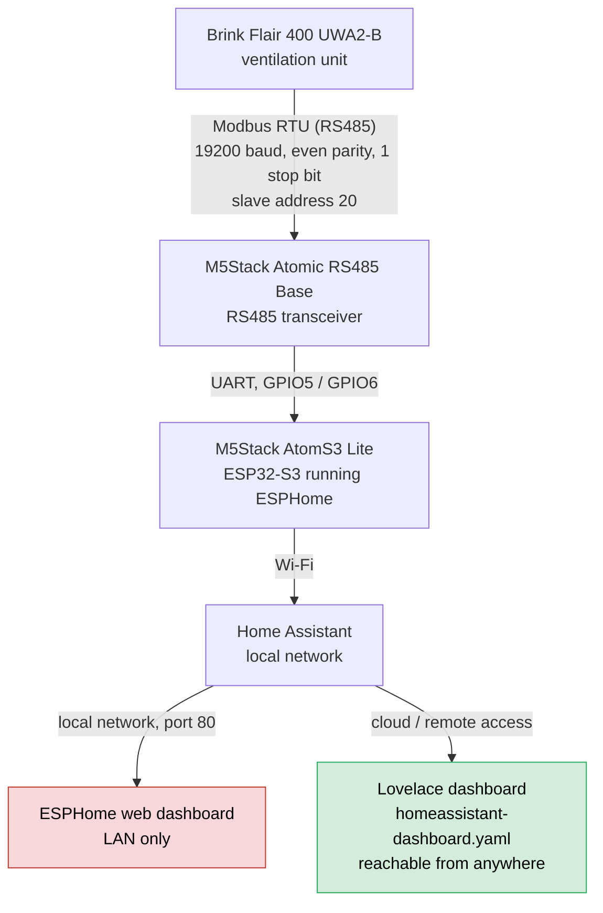

# Brink Flair 400 ESPHome Modbus

ESPHome configuration for locally integrating a Brink Flair 400 ventilation
unit with Home Assistant via Modbus RTU.

## Target hardware

- Brink Flair 400 Standard UWA2-B
- M5Stack AtomS3 Lite
- M5Stack Atomic RS485 Base
- Modbus RTU: address 20, 19,200 baud, even parity, 1 stop bit

Other Flair models or hardware variants may use different registers,
addresses, or GPIO assignments. Verify these settings against your own unit
before flashing the ESP32.

## Architecture



The ESP32 talks to the ventilation unit over Modbus RTU and to Home Assistant
over Wi-Fi/the native API. The ESPHome device's own web dashboard (red) stays
local-network-only; the Lovelace dashboard (green, see
[Remote dashboard in Home Assistant](#remote-dashboard-in-home-assistant))
rides along with Home Assistant's own remote/cloud access instead.

## Features

- Temperature, humidity, airflow, pressure, and fan-speed readings
- Bypass, frost-protection, and filter status
- Operating-mode and fan-stage selection, including standby
- Filter reset, bypass boost, and additional configurable values
- Read-back verification for Modbus write commands
- Home Assistant API, local web server, and OTA updates

No Modbus write command is sent during startup or when a connection is
established. Write commands are issued only after an explicit user action.

## Installation

1. Copy `brinkflair400.yaml` into your ESPHome configuration directory.
2. Copy `secrets.example.yaml` to `secrets.yaml`.
3. Replace every example value in `secrets.yaml` with your own credentials and
   randomly generated keys.
4. Verify the GPIO assignments, Modbus address, and appliance settings.
5. Validate the configuration in ESPHome and install it on the ESP32.
6. Add the automatically discovered ESPHome device to Home Assistant.

Example for local validation:

```shell
esphome config brinkflair400.yaml
```

`secrets.yaml` is excluded from Git by `.gitignore`.

## Remote dashboard in Home Assistant

The ESPHome device's built-in `web_server` is only reachable on the local
network. When Home Assistant is accessed remotely (for example through
Nabu Casa cloud), that local dashboard is not reachable, since remote access
proxies the Home Assistant frontend itself, not other devices on the local
network.

`homeassistant-dashboard.yaml` provides a native Home Assistant Lovelace
dashboard that mirrors the ESPHome dashboard's functionality using the
entities already exposed through the Home Assistant API. It therefore works
wherever Home Assistant itself is reachable, without exposing the ESP32 to
the internet.

To use it:

1. Replace every `DEIN_BEREICH_` placeholder in the file with the actual
   entity-ID prefix used by your Home Assistant instance. Look up the exact
   entity IDs under Developer Tools -> States, filtering by "brink".
2. In Home Assistant, go to Settings -> Dashboards -> Add Dashboard ->
   "New dashboard from scratch".
3. Open the new dashboard, click the pencil (edit) icon, then the three-dot
   menu -> "Raw configuration editor".
4. Replace the existing content with the file's content and save.

## Safety and security

Disconnect the ventilation unit completely from power before working on its
terminals. Modbus write commands can change the operating state of the unit.
Use registers and values only after confirming that they match your appliance
and firmware version.

The API, OTA interface, fallback access point, and web server use values from
`secrets.yaml`. Do not expose the ESPHome device or Home Assistant directly to
the internet without appropriate protection.

## Origin and license

The standalone configuration is derived from
[fonske/Brink-flair-modbus](https://github.com/fonske/Brink-flair-modbus)
and was adapted for the Brink Flair 400, M5Stack AtomS3 Lite, and explicitly
triggered control commands with read-back verification.

In accordance with the upstream project, this project is licensed under the
GNU General Public License Version 3 or later. See `LICENSE`.

Brink is a trademark of its respective owner. This community project is not
affiliated with or endorsed by the manufacturer.
